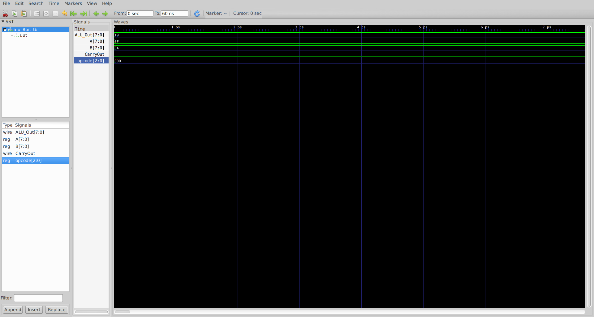
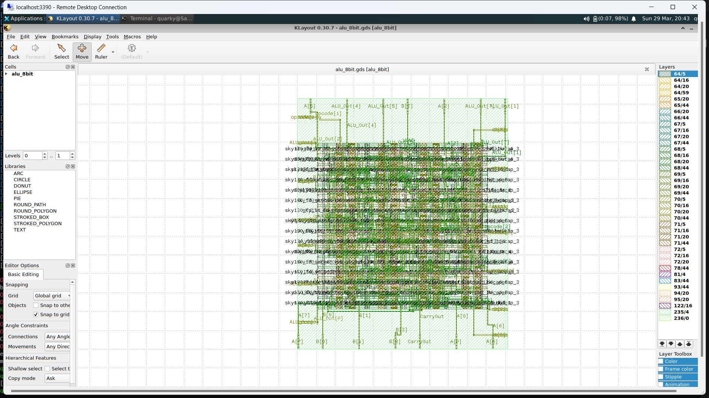
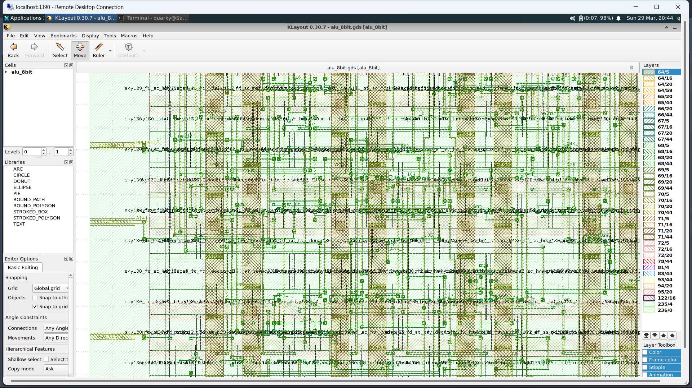

# RTL-to-GDS Implementation of 8-bit ALU

## Overview

This project demonstrates the complete RTL-to-GDSII physical design flow of an 8-bit Arithmetic Logic Unit (ALU) using the OpenLane toolchain and Sky130 PDK. It covers the entire backend VLSI pipeline from Verilog RTL design to final GDSII layout generation, including synthesis, floorplanning, placement, clock tree synthesis, routing, and signoff verification.

---

## Key Highlights

- Designed an 8-bit ALU in Verilog HDL with a dedicated testbench
- Implemented full RTL to GDSII flow using OpenLane
- Used Sky130 standard cell library
- Generated timing, power, skew, and IR drop reports at every stage
- Multi-corner analysis across Fastest, Typical, and Slowest process corners
- Achieved DRC and LVS clean design
- Visualized layout using KLayout and Magic VLSI

---

## Flow Overview
```
RTL (Verilog)
     |
Synthesis (Yosys)
     |
Floorplanning
     |
Placement (Global + Detailed)
     |
Clock Tree Synthesis (CTS)
     |
Routing (Global + Detailed)
     |
Signoff (DRC, LVS, STA, IR Drop)
     |
GDSII Generation
```

---

## Tools and Technologies

| Tool | Purpose |
|------|---------|
| OpenLane | End-to-end RTL-to-GDS flow |
| OpenROAD | Physical design engine |
| Yosys | RTL synthesis |
| Magic VLSI | DRC and layout processing |
| KLayout | Layout visualization |
| Icarus Verilog | RTL simulation |
| GTKWave | Waveform viewing |
| Sky130 PDK | Process Design Kit |

---

## Repository Structure
```
RTL-to-GDS-ALU/
|-- src/
|   |-- 8bitALU.v              # RTL design
|   |-- alu_synth.v            # Post-synthesis netlist
|-- testbench/
|   |-- 8bitALU_tb.v           # Testbench
|-- simulation/
|   |-- alu_wave.vcd           # Simulation waveform data
|   |-- alu_wave.gtkw          # GTKWave save file
|   |-- alu_wave.png           # Waveform screenshot
|-- config/
|   |-- config.json            # OpenLane configuration
|-- scripts/
|   |-- run_openlane.sh        # Flow automation script
|-- reports/
|   |-- synthesis/             # Synthesis STA, area, power reports
|   |-- floorplan/             # Core and die area reports
|   |-- placement/             # Global and detailed placement STA
|   |-- cts/                   # CTS timing, power, skew reports
|   |-- routing/               # Routing STA, DRC, wire lengths
|   |-- signoff/               # Final DRC, LVS, IR drop, STA reports
|   |-- manufacturability.rpt  # Manufacturability summary
|   |-- metrics.csv            # Flow metrics
|-- results/
|   |-- synthesis/             # Synthesized netlist and SDF
|   |-- floorplan/             # Floorplan DEF and ODB
|   |-- placement/             # Placement DEF, netlist
|   |-- cts/                   # CTS DEF, SDC, ODB
|   |-- routing/               # Routed DEF, MCA outputs
|   |-- signoff/               # Final GDS, LEF, SPICE, MAG
|   |-- final/                 # Final outputs (GDS, DEF, LEF, LIB, SDF, SPEF, SPICE)
|-- images/
|   |-- layout_full.png        # Full layout view
|   |-- zoomed.png             # Zoomed layout view
|   |-- routing.png            # Routing visualization
|-- alu_8bit.gds               # Final GDSII file (root copy)
|-- .gitignore
|-- README.md
```

---

## Simulation Results

The RTL design was simulated using Icarus Verilog and the waveform was viewed in GTKWave to verify functional correctness before running the physical design flow.



---

## Layout Visualization

### Full Layout


### Zoomed View


### Routing


---

## Results Summary

| Metric | Status |
|--------|--------|
| Technology | Sky130 |
| DRC | Clean |
| LVS | Clean |
| Timing Violations | None |
| Multi-Corner Analysis | Fastest, Typical, Slowest |
| IR Drop Analysis | Completed (VPWR and VGND) |
| Power Analysis | Completed |
| Antenna Violations | Checked |

---

## Output Files Reference

| File | Description |
|------|-------------|
| results/final/gds/alu_8bit.gds | Final GDSII layout |
| results/final/def/alu_8bit.def | Physical design database |
| results/final/verilog/gl/alu_8bit.v | Gate-level netlist |
| results/final/sdf/alu_8bit.sdf | Timing annotation data |
| results/final/spef/alu_8bit.spef | Parasitic extraction |
| results/final/lef/alu_8bit.lef | Library exchange format |
| results/final/lib/alu_8bit.lib | Liberty timing model |
| reports/signoff/drc.rpt | DRC report |
| reports/signoff/39-alu_8bit.lvs.rpt | LVS report |
| reports/signoff/32-irdrop-VPWR.rpt | IR drop VPWR |
| reports/signoff/32-irdrop-VGND.rpt | IR drop VGND |

---

## How to Reproduce

### 1. Clone OpenLane
```bash
git clone https://github.com/The-OpenROAD-Project/OpenLane.git
cd OpenLane
make setup
```

### 2. Enable PDK
```bash
make pdk
```

### 3. Add Design

Place the contents of the src folder into:
```
designs/alu_8bit/src/
```

Place config.json into:
```
designs/alu_8bit/
```

### 4. Run Flow
```bash
make mount
./flow.tcl -design alu_8bit
```

### 5. Run Simulation (Optional)
```bash
iverilog -o alu_sim testbench/8bitALU_tb.v src/8bitALU.v
vvp alu_sim
gtkwave simulation/alu_wave.vcd
```

---

## Learning Outcomes

- Complete understanding of the RTL-to-GDSII physical design flow
- Hands-on experience with industry-standard open-source EDA tools
- Multi-corner static timing analysis across process corners
- Understanding of DRC, LVS, IR drop analysis, and antenna checks
- Parasitic extraction and back-annotation using SPEF and SDF

---

## Future Improvements

- Extend design to 16-bit or 32-bit ALU
- Add pipelining for higher clock frequency
- Optimize area and power through constraint tuning
- Integrate formal verification

---

## Author

Sarthak Tripathi
Electronics Engineering Student, VLSI Design and Technology
Jaypee Institute of Information Technology, Noida
GitHub: https://github.com/quarky-1

---

## Acknowledgements

- OpenLane Team
- OpenROAD Project
- SkyWater PDK Initiative
```

